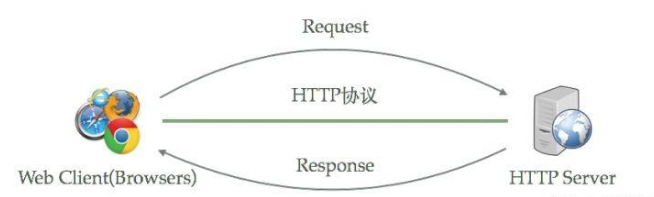
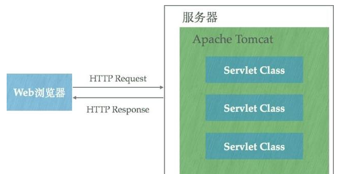

# HTTP

HTTP 服务器本质上也是一种应用程序:

1. 它通常运行在服务器之上
2. 绑定服务器的 IP 地址
3. 并监听某一个 TCP 端口来接收并处理 HTTP 请求

客户端（一般来说是浏览器）就能够通过 **HTTP协议**来获取服务器上的:

- 网页（HTML 格式）
- 文档（PDF 格式）
- 音频（MP4 格式）
- 视频（MOV 格式）等资源

## HTTP类库

不仅仅是 Apache HTTP Server 和 Nginx，绝大多数编程语言所包含的类库中也都实现了简单的 HTTP 服务器方便开发者使用：

- HttpServer ([Java HTTP Server](https://docs.oracle.com/javase/8/docs/jre/api/net/httpserver/spec/com/sun/net/httpserver/HttpServer.html))
- Python [SimpleHTTPServer](https://docs.python.org/2/library/simplehttpserver.html)

使用这些类库能够非常容易的运行一个 HTTP 服务器，它们都能够通过**绑定IP地址**并**监听TCP端口**来提供 HTTP 服务。

## Apache Tomcat

与 Apache HTTP Server 相比，Tomcat 能够**动态的生成资源并返回到客户端**。

> Apache HTTP Server 和 Nginx 都能够将某一个文本文件的内容通过 HTTP 协议返回到客户端，但是这个文本文件的内容是固**定的**——也就是说无论何时、任何人访问它得到的内容都是完全相同的，这样的资源我们称之为**静态资源**。

**动态资源**则与之相反，在不同的时间、不同的客户端访问得到的内容是不同的，例如：

- 包含显示当前时间的页面
- 显示当前IP地址的页面

> Apache HTTP Server 和 Nginx 本身不支持生成动态页面，但它们可以通过其他模块来支持（例如通过 Shell、PHP、Python 脚本程序来动态生成内容）。

如果想要使用 Java 程序来动态生成资源内容，使用这一类 HTTP 服务器很难做到。Java Servlet 技术以及衍生的 Java Server Pages 技术可以让 Java 程序也具有处理 HTTP 请求并且返回内容（由程序动态控制）的能力，Tomcat 正是支持运行 Servlet/JSP 应用程序的容器（Container）:

Tomcat 运行在 JVM 之上，它和 HTTP 服务器一样，绑定 IP 地址并监听 TCP 端口，同时还包含以下职责：

1. 管理 Servlet 程序的生命周期
2. 将 URL 映射到指定的 Servlet 进行处理
3. 与 Servlet 程序合作处理 HTTP 请求——根据 HTTP 请求生成 HttpServletResponse 对象并传递给 Servlet 进行处理，将 Servlet 中的 HttpServletResponse 对象生成的内容返回给浏览器

虽然 Tomcat 也可以认为是 HTTP 服务器，但通常它仍然会和 Nginx 配合在一起使用：

- 动静态资源分离——运用 Nginx 的反向代理功能分发请求：所有动态资源的请求交给 Tomcat，而静态资源的请求（例如图片、视频、CSS、JavaScript 文件等）则直接由Nginx 返回到浏览器，这样能大大减轻 Tomcat 的压力。
- 负载均衡，当业务压力增大时，可能一个 Tomcat 的实例不足以处理，那么这时可以启动多个 Tomcat 实例进行水平扩展，而 Nginx 的负载均衡功能可以把请求通过算法分发到各个不同的实例进行处理。

## 总结

Apache 和 Nginx 是**静态服务器**，适合处理静态资源。

而 Tomcat 适合**动态生成内容**，返回给客户端，常作为 Java Web 项目的容器。
